# Jankx Option Adapter

Jankx Option Adapter là một hệ thống thông minh cho phép Jankx Framework hoạt động với nhiều framework options khác nhau. Bạn có thể chọn framework yêu thích của mình.

## 🏗️ Architecture Overview

### **1. Core Framework Flow**

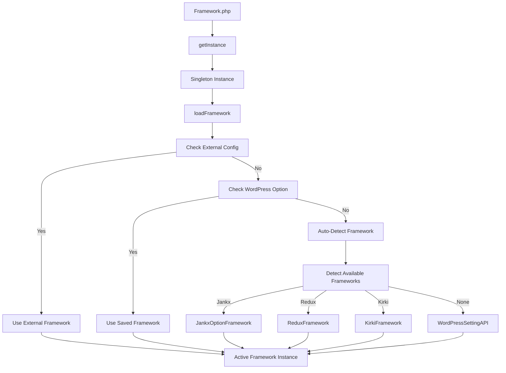

### **2. Adapter Pattern Structure**

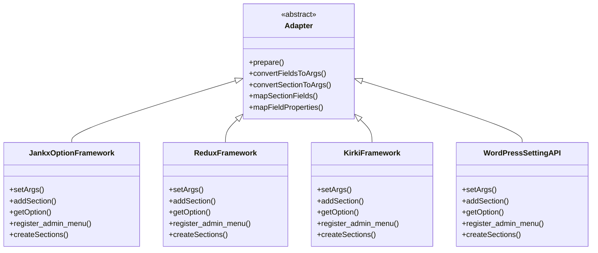

### **3. Configuration Flow**

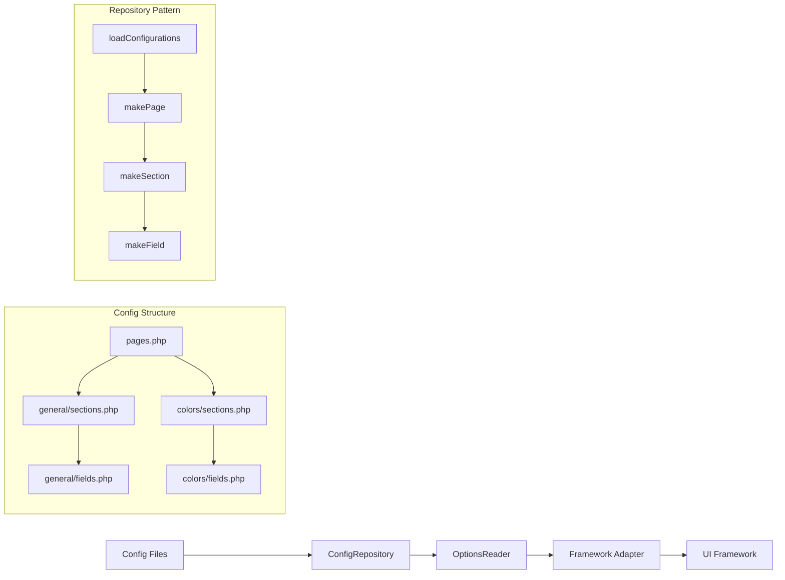

### **4. Data Flow Architecture**

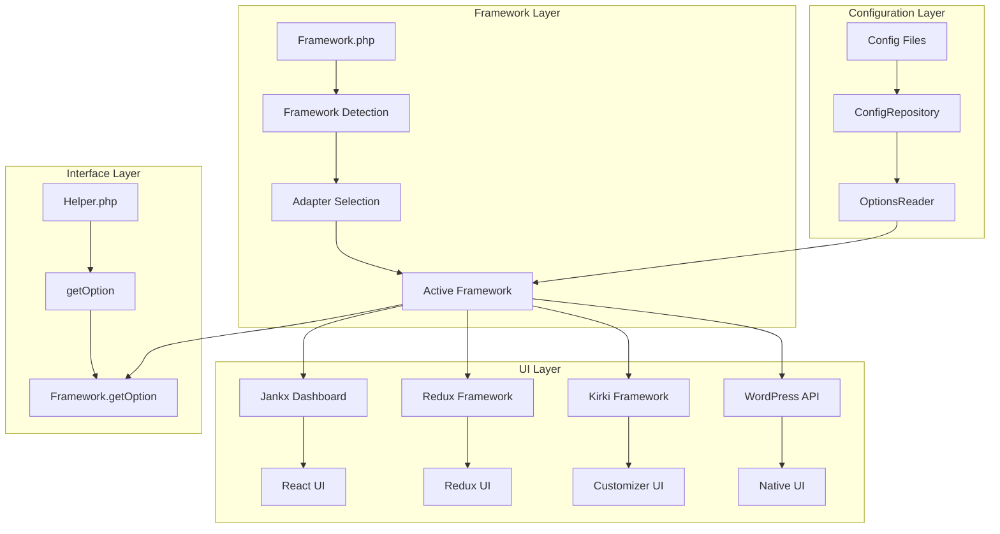

### **5. Framework Detection Logic**

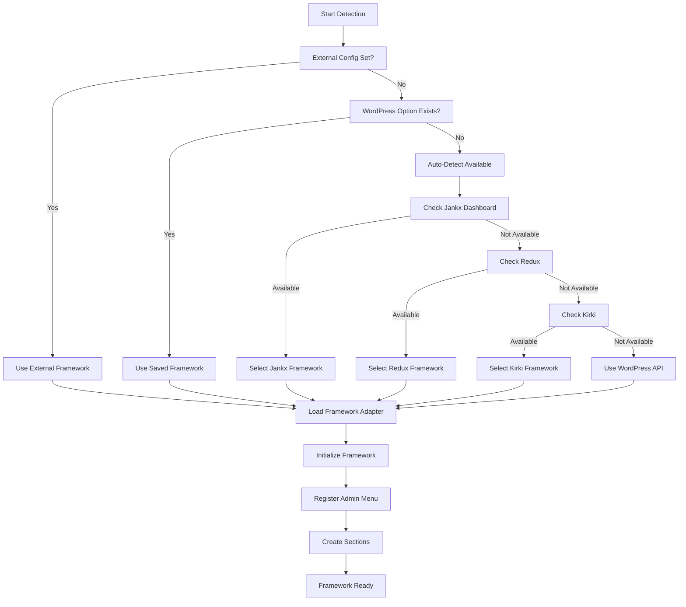

### **6. Helper Function Flow**

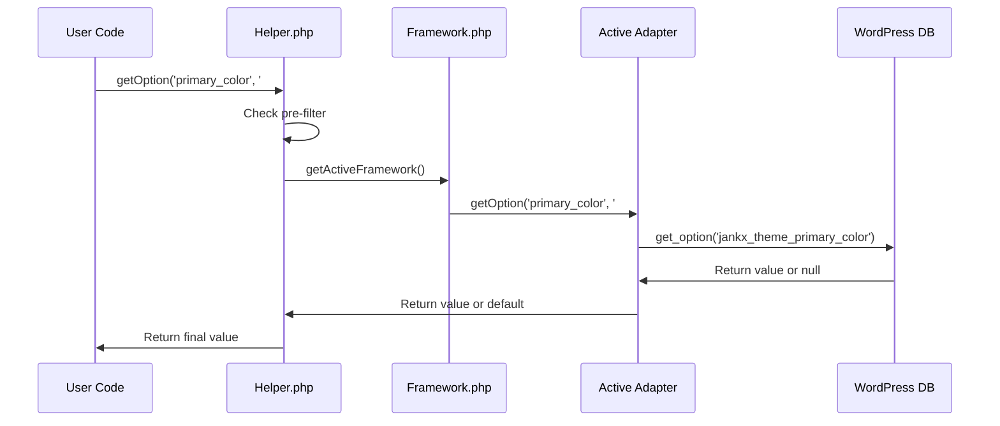

### **7. Configuration Structure**

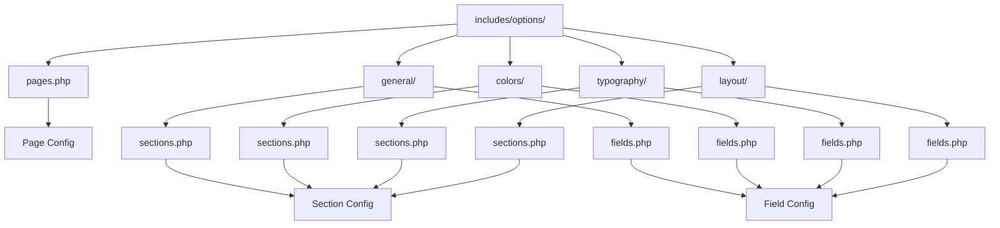

### **8. Method Call Flow**

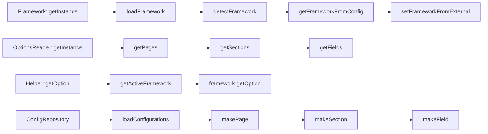

## 🎯 Theme Options Hierarchy Structure

### **1. Main Hierarchy Flow**

```mermaid
graph TD
    A[Theme Options] --> B[Page 1: General]
    A --> C[Page 2: Header]
    A --> D[Page 3: Footer]
    A --> E[Page 4: Colors]
    A --> F[Page 5: Typography]
    A --> G[Page 6: Layout]
    A --> H[Page 7: Social]
    A --> I[Page 8: Advanced]

    B --> B1[Section 1: Site Info]
    B --> B2[Section 2: Logo]
    B --> B3[Section 3: Favicon]

    C --> C1[Section 1: Header Style]
    C --> C2[Section 2: Navigation]
    C --> C3[Section 3: Sticky Header]

    D --> D1[Section 1: Footer Style]
    D --> D2[Section 2: Footer Content]
    D --> D3[Section 3: Footer Widgets]

    E --> E1[Section 1: Primary Colors]
    E --> E2[Section 2: Secondary Colors]
    E --> E3[Section 3: Text Colors]

    F --> F1[Section 1: Body Typography]
    F --> F2[Section 2: Heading Typography]
    F --> F3[Section 3: Button Typography]

    G --> G1[Section 1: Container]
    G --> G2[Section 2: Sidebar]
    G --> G3[Section 3: Grid]

    H --> H1[Section 1: Social Links]
    H --> H2[Section 2: Social Icons]

    I --> I1[Section 1: Custom CSS]
    I --> I2[Section 2: Custom JS]
    I --> I3[Section 3: Analytics]
```

### **2. Detailed Page Structure**

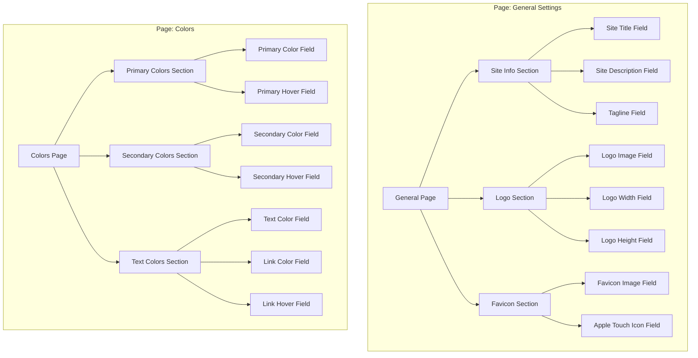

### **3. Data Structure Relationships**

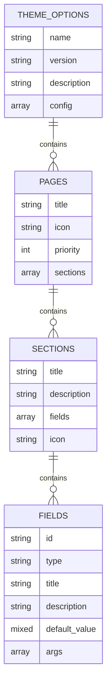

### **4. Configuration File Structure**

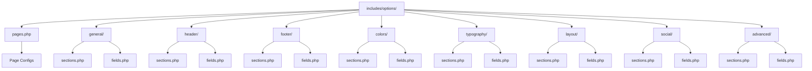

### **5. Class Relationships**

```mermaid
classDiagram
    class ThemeOptions {
        +getInstance()
        +addPage()
        +getPages()
        +getPage()
    }

    class Page {
        +getTitle()
        +getSections()
        +addSection()
        +getIcon()
        +getPriority()
    }

    class Section {
        +getTitle()
        +getFields()
        +addField()
        +getDescription()
        +getIcon()
    }

    class Field {
        +getId()
        +getType()
        +getTitle()
        +getValue()
        +getDefault()
        +getArgs()
    }

    ThemeOptions ||--o{ Page : contains
    Page ||--o{ Section : contains
    Section ||--o{ Field : contains
```

### **6. Navigation Flow**

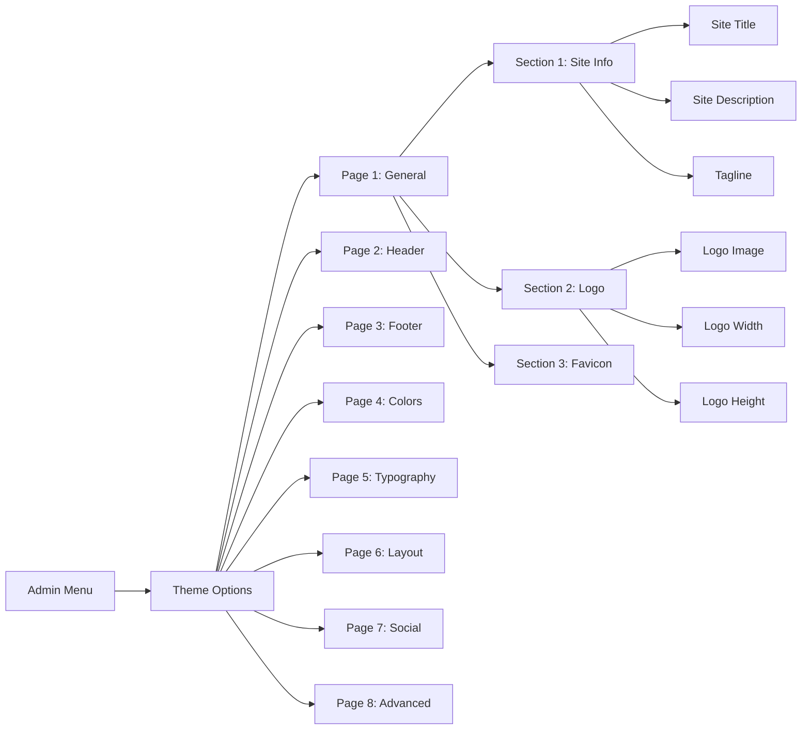

### **7. Data Loading Flow**

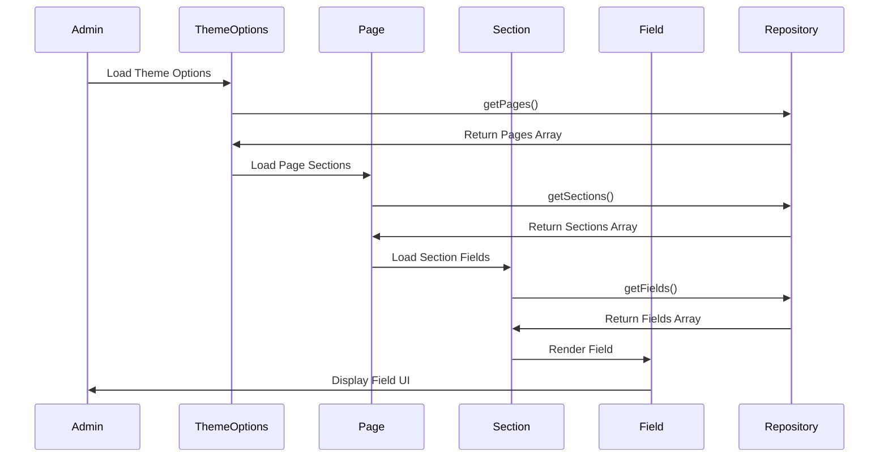

### **8. Example Configuration Structure**

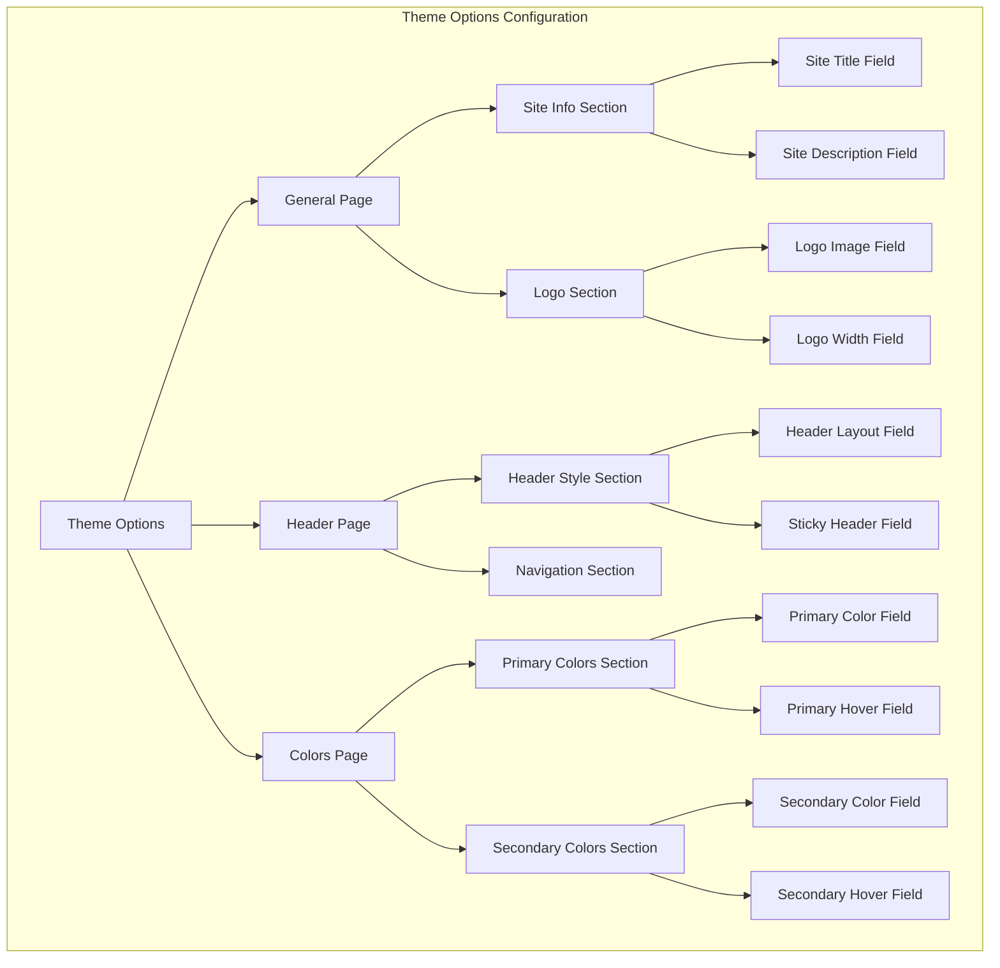

## 🎯 Key Concepts

### **1. Adapter Pattern**
- **Abstract Adapter**: Base class cho tất cả frameworks
- **Concrete Adapters**: Implementation cho từng framework
- **Interface Consistency**: Tất cả adapters implement cùng interface

### **2. Repository Pattern**
- **ConfigRepository**: Quản lý configuration data
- **OptionsReader**: Interface để đọc options
- **File-based Config**: Configuration từ PHP files

### **3. Factory Pattern**
- **Framework Detection**: Tự động chọn framework phù hợp
- **Adapter Creation**: Tạo adapter instance
- **Fallback Mechanism**: Luôn có fallback option

### **4. Singleton Pattern**
- **Framework Instance**: Chỉ có 1 instance của framework
- **OptionsReader**: Singleton cho reading operations
- **Helper Functions**: Global access point

### **5. One-to-Many Relationships**
- **1 Theme Options** → **Many Pages**
- **1 Page** → **Many Sections**
- **1 Section** → **Many Fields**

### **6. Navigation Structure**
- **Admin Menu** → **Theme Options**
- **Theme Options** → **Page Navigation**
- **Page** → **Section Tabs**
- **Section** → **Field Forms**

### **7. Data Hierarchy**
- **Theme Options** (Root)
  - **Pages** (Level 1)
    - **Sections** (Level 2)
      - **Fields** (Level 3)

### **8. Configuration Files**
- **pages.php** - Define all pages
- **{page}/sections.php** - Define sections for each page
- **{page}/fields.php** - Define fields for each section

## Benefits

### **1. Flexibility**
- ✅ Hỗ trợ nhiều framework options
- ✅ Dễ dàng switch giữa frameworks
- ✅ Auto-detection thông minh

### **2. Maintainability**
- ✅ Clean separation of concerns
- ✅ Interface-based design
- ✅ Easy to extend

### **3. Developer Experience**
- ✅ Simple helper functions
- ✅ Configuration-based setup
- ✅ Automatic conversion

### **4. Performance**
- ✅ Lazy loading
- ✅ Caching mechanisms
- ✅ Efficient detection

## Usage Examples

### **Cách 1: Auto-Detection (Khuyến nghị)**
```php
// functions.php
use Jankx\Adapter\Options\Framework;
use Jankx\Adapter\Options\Helper;

// Auto-detect và load framework
$optionFramework = Framework::getInstance();
$optionFramework->loadFramework();

// Sử dụng helper
$primary_color = Helper::getOption('primary_color', '#007cba');
```

### **Cách 2: Force Framework**
```php
// functions.php
use Jankx\Adapter\Options\Framework;

// Force sử dụng Jankx Dashboard Framework
Framework::setFrameworkFromExternal('jankx');
$optionFramework = Framework::getInstance();
$optionFramework->loadFramework();
```

### **Cách 3: Configuration-Based**
```php
// Tạo config files
// includes/options/pages.php
// includes/options/general/sections.php
// includes/options/general/fields.php

// Framework sẽ tự động load từ config
```

## Supported Frameworks

### **1. Jankx Dashboard Framework**
- ✅ UI đẹp với React
- ✅ Tích hợp hoàn toàn với Jankx Framework
- ✅ Configuration-based setup

### **2. Redux Framework**
- ✅ Nhiều field types
- ✅ Advanced features
- ✅ Large community

### **3. Kirki Framework**
- ✅ WordPress Customizer integration
- ✅ Typography controls
- ✅ Color controls

### **4. WordPress Settings API**
- ✅ Native WordPress
- ✅ Đơn giản, nhẹ
- ✅ Không cần framework bên ngoài

## Framework Priority

```
1. Jankx Dashboard Framework (nếu có)
2. Redux Framework (nếu có)
3. Kirki Framework (nếu có)
4. WordPress Settings API (fallback)
```

---

**Version**: 1.0.0
**Author**: Puleeno Nguyen
**License**: MIT
