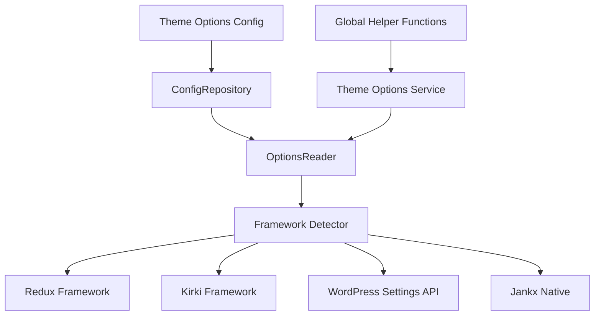

# Jankx Option Adapter

Package này cung cấp một adapter pattern để tích hợp các framework options khác nhau (Redux, Kirki, WordPress Settings API) với Jankx Framework.

## 🏗️ Kiến trúc



## 📁 Cấu trúc Package

```
option-adapter/
├── src/
│   ├── Framework.php (Core Framework Detector)
│   ├── OptionsReader.php (Interface để đọc options)
│   ├── Helper.php (Global helper functions)
│   ├── Frameworks/
│   │   ├── ReduxFramework.php
│   │   ├── KirkiFramework.php
│   │   ├── WordPressFramework.php
│   │   └── JankxFramework.php
│   ├── Repositories/
│   │   └── ConfigRepository.php (Load config từ files)
│   └── Transformers/
│       ├── AbstractTransformer.php
│       ├── ReduxTransformer.php
│       ├── KirkiTransformer.php
│       └── WordPressTransformer.php
├── tests/
│   └── configs/ (Cấu trúc chuẩn cho options)
└── docs/
    └── README.md
```

## 🎯 Cấu trúc Options Data

### Hierarchy
```
Theme Options
├── Pages
│   ├── Sections
│   │   └── Fields
│   └── Sections
│       └── Fields
└── Pages
    └── Sections
        └── Fields
```

### File Structure
```
resources/theme-options/
├── pages.php (Danh sách pages)
├── general/
│   ├── site_info.php (section + fields)
│   ├── logo_settings.php (section + fields)
│   └── favicon_settings.php (section + fields)
├── colors/
│   ├── primary_colors.php (section + fields)
│   └── secondary_colors.php (section + fields)
└── ...
```

### Data Format

#### pages.php
```php
<?php
return [
    [
        'id' => 'general',
        'name' => 'General Settings',
        'args' => [
            'description' => 'General theme settings',
        ],
    ],
    [
        'id' => 'colors',
        'name' => 'Color Settings',
        'args' => [
            'description' => 'Theme color customization',
        ],
    ],
];
```

#### section_file.php
```php
<?php
return [
    'id' => 'site_info',
    'name' => 'Site Information',
    'description' => 'Basic site information settings',
    'fields' => [
        [
            'id' => 'site_title',
            'name' => 'Site Title',
            'type' => 'text',
            'value' => '',
            'default_value' => 'My Website',
            'sub_title' => 'Enter your site title',
            'description' => 'This will be displayed in browser tab',
        ],
        [
            'id' => 'site_logo',
            'name' => 'Site Logo',
            'type' => 'image',
            'value' => '',
            'default_value' => '',
            'sub_title' => 'Upload your site logo',
            'description' => 'Recommended size: 200x60px',
            'options' => [
                'preview_size' => 'medium',
            ],
        ],
    ],
];
```

## 🔧 Cách sử dụng

### 1. Khởi tạo Options Reader

```php
// Set options directory
OptionsReader::setOptionsDirectoryPath(get_template_directory() . '/resources/theme-options');

// Hoặc sử dụng filter
add_filter('jankx/options/directory', function() {
    return get_template_directory() . '/resources/theme-options';
});
```

### 2. Đọc Options

```php
// Lấy tất cả pages
$pages = OptionsReader::getPages();

// Lấy sections của page
$sections = OptionsReader::getSections('general');

// Lấy fields của section
$fields = OptionsReader::getFields('general', 'site_info');
```

### 3. Framework Detection

```php
// Tự động detect framework
$framework = Framework::getInstance();
$activeFramework = $framework->getActiveFramework();

// Hoặc force sử dụng framework cụ thể
$framework->setFrameworkFromExternal('redux');
```

### 4. Global Helper Functions

```php
// Lấy option value
$siteTitle = \Jankx\Adapter\Options\Helper::getOption('site_title', 'default_value');

// Set option value
\Jankx\Adapter\Options\Helper::setOption('site_title', 'New Site Title');

// Check option exists
if (\Jankx\Adapter\Options\Helper::hasOption('site_logo')) {
    // Do something
}
```

## 🎨 Supported Field Types

| Type | Description | Framework Support |
|------|-------------|------------------|
| `text` | Text input | All |
| `textarea` | Multi-line text | All |
| `image` | Image upload | All |
| `icon` | Icon picker | Redux, Kirki |
| `color` | Color picker | All |
| `select` | Dropdown select | All |
| `radio` | Radio buttons | All |
| `checkbox` | Checkbox | All |
| `switch` | Toggle switch | Redux, Kirki |
| `slider` | Range slider | Redux, Kirki |
| `typography` | Typography settings | Redux, Kirki |

## 🔄 Transformer Pattern

### Input (Dashboard Native Format)
```php
Section {
    id: 'site_info',
    name: 'Site Information',
    fields: [
        Field {
            id: 'site_title',
            name: 'Site Title',
            type: 'text',
            default_value: 'Default'
        }
    ]
}
```

### Output (Redux Format)
```php
[
    'id' => 'site_info',
    'title' => 'Site Information',
    'fields' => [
        [
            'id' => 'site_title',
            'type' => 'text',
            'title' => 'Site Title',
            'default' => 'Default'
        ]
    ]
]
```

## 🚀 Integration với Service Providers

### ThemeOptionsServiceProvider
```php
namespace App\Providers;

class ThemeOptionsServiceProvider extends ServiceProvider
{
    public function boot()
    {
        // Set options directory
        OptionsReader::setOptionsDirectoryPath(
            get_template_directory() . '/resources/theme-options'
        );

        // Register global helpers
        $this->registerGlobalHelpers();
    }

    protected function registerGlobalHelpers()
    {
        // Helper functions sẽ được register ở đây
    }
}
```

### DashboardServiceProvider
```php
namespace App\Providers;

class DashboardServiceProvider extends ServiceProvider
{
    public function boot()
    {
        // Register admin menu
        add_action('admin_menu', [$this, 'registerThemeOptionsMenu']);

        // Setup framework integration
        add_action('admin_init', [$this, 'setupThemeOptions']);
    }

    public function registerThemeOptionsMenu()
    {
        // Add theme options menu item
    }

    public function setupThemeOptions()
    {
        // Transform và register với framework
    }
}
```

## 📋 Configuration

### config/app.php
```php
return [
    'options' => [
        'framework' => 'redux', // redux, kirki, wordpress, jankx
        'directory' => 'resources/theme-options',
    ],
    'providers' => [
        App\Providers\ThemeOptionsServiceProvider::class,
        App\Providers\DashboardServiceProvider::class,
    ],
];
```

## 🧪 Testing

Package có sẵn cấu trúc test trong `tests/configs/` để test các framework khác nhau:

```php
// Test với Redux
$framework->setFrameworkFromExternal('redux');
$options = OptionsReader::getPages();

// Test với Kirki
$framework->setFrameworkFromExternal('kirki');
$options = OptionsReader::getPages();
```

## 🔒 Security

- Tất cả files config phải có `ABSPATH` check
- Options được validate trước khi save
- Nonce verification cho admin actions
- Capability checks (`manage_options`)

## 📚 Examples

Xem thêm examples trong thư mục `tests/configs/` để hiểu rõ cách tạo cấu trúc options.
